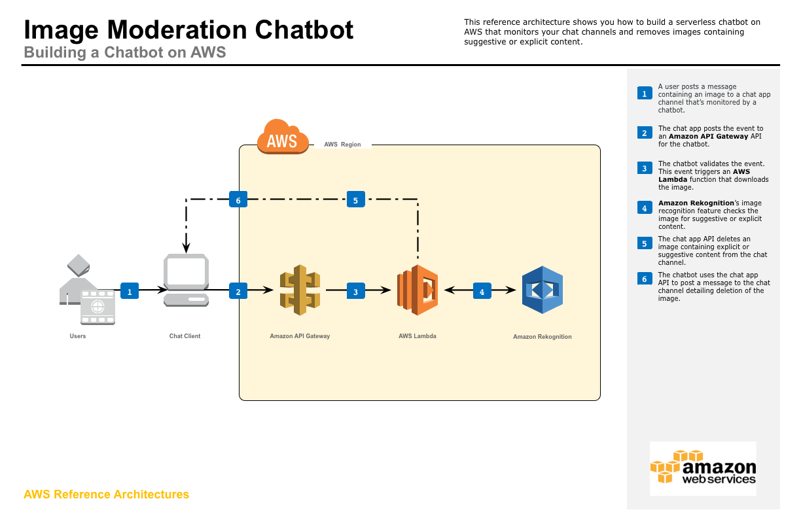

# Science Montgomery 2019 - Aditi and Om  Architecture: Real time sentiment analysis of twitter feed to understand emotional state

This project is meant to process the tweets in real time for sentiment analysis

This reference implementation primarity uses many  [AWS](https://aws.amazon.com/) services like S3, Amazon compregend etc..
The architure of the implementation was inspired by 
 a bog post [Build a social media dashboard using machine learning and BI services]
 (https://aws.amazon.com/blogs/machine-learning/build-a-social-media-dashboard-using-machine-learning-and-bi-services/)



## Walkthrough of the Architecture
1. A user posts a message on twitter which is monitored by this application.
1. The twitter posts the event to an Amazon API Gateway API for the sentiment analysis.
1. The API Gateway stores the the post in S3 as raw data.
1. S3 event triggers the Lambda function
1. Lambda function sends the post conter to AWS comprehend for sentiment analysis
1. Amazon Comphrehend performs the sentiment analysis and saves result in S3 .


## Running the Example
### Preparing Twitter Access

### Launching the Processing Backend on AWS
#### STEP 0 : Prep steps
1. Install AWS CLI on local machine


#### STEP 1 : Login to AWS to run AWS CLI.
Check if it is already configured from terminal window
```` bash
cat ~/.aws/credentials
cat ~/.aws/config
````
else configure get `AWS Access Key ID` and `Secret Key`. 
run below commands from terminal window

```` bash
aws configure
````

then pass access and secret keys, select region and format as defaults

after login create a bucket to stage cloudformation templates

```` bash
aws s3api create-bucket --bucket mystacks --region us-east-1
````

#### STEP 2: Launch the CloudFormation Template Manually 
If you would like to deploy the template manually, you need a S3 bucket in the target region, 
and then package the Lambda functions into that S3 bucket by using the `aws cloudformation package` utility.

Set environment variables for later commands to use:
Update `setenv.sh` with appropriate values

```bash
S3BUCKET=[REPLACE_WITH_YOUR_BUCKET]
REGION=[REPLACE_WITH_YOUR_REGION]
STACKNAME=[REPLACE_WITH_DESIRED_NAME]
VTOKEN=[REPLACE_WITH_VERIFICATION_TOKEN]
ATOKEN=[REPLACE_WITH_OAUTH_ACCESS_TOKEN]
```

the run 
```bash
source ./setenv.sh
```

Then go to the `cloudformation` folder and use the `aws cloudformation package` utility

```bash
cd cloudformation

aws cloudformation package --region $REGION --s3-bucket $S3BUCKET --template twitter_feed_processor.serverless.yaml --output-template-file twitter_feed_processor.output.yaml
```
Last, deploy the stack with the resulting yaml (`image_moderator.output.yaml`) through the CloudFormation Console or command line:

```bash
aws cloudformation deploy --region $REGION --template-file twitter_feed_processor.output.yaml --stack-name $STACKNAME --capabilities CAPABILITY_NAMED_IAM --parameter-overrides VerificationToken=$VTOKEN AccessToken=$ATOKEN
```

Repeat build and deploy steps when ever there is change in the code
